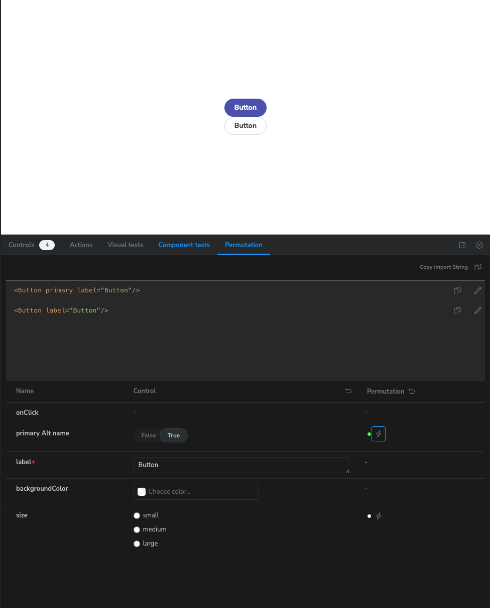

<div align="center">
  
  <h1>sb-permutation</h1>
  <span></span>
  <span></span>
  <span></span>
  <div>
  <strong><a href="https://daimresearch.github.io/sb-permutation/?path=/docs/introduction--docs" target="_blank">Demos</a></strong>
  </div>
</div>
<hr/>

### Before you Read

- This addon is forked version of [sb-permutation](https://daimresearch.github.io/sb-permutation). This project adds bug fixes, version compatibility, and utility features that were not addressed in the original project. But, The basic project direction is the same.

- This is only guaranteed to work with React-based projects. Other frameworks may introduce unintended errors.


This project is an addon that provides additional functionality to Storybook. In a separate panel, you can see the various aspects of the component as a table.

This project was highly inspired by Datadog's design system, [DRUIDS](https://druids.datadoghq.com/), and we wanted to use the Component Permutation feature from DRUIDS in Storybook.

---

## Table of contents

- [Feature](#feature)
- [Installation](#installation)
  - [Requirements](#requirements)
- [Why should I use it?](#why-should-i-use-it)
- [Usage](#usage)
  - [Example](#example)
  - [Advance](#advance)
- [Demos](#demos)
- [FAQ](#faq)
- [License](#license)

### Feature

- `Argument Control` : Manipulate the properties of your component directly. You can see what your component looks like in context.

- `Permutation` : Provide a table of different views with combinations of properties. Compare and analyze the results of combinations at a glance.

### Installation

`yarn add sb-permutation`

`npm install sb-permutation`

#### Requirements

- `Storybook >= 8.x`
- `node > 16.x`

### For users using below React 19

~~- try version 1.0.3
`yarn add sb-permutation@1.0.3`~~

~~this version supports SB8 && React 18~~

~~SB 8.5 has decided to support React 19, and using the latest version of the addon will cause conflicts.~~

NOW IN PROGRESS

#### For users under SB 7.x

~~- try version 1.0.21
`yarn add sb-permutation@1.0.21`~~

NOW IN PROGRESS

### Why should I use it?

`sb-addon-permutation` provides a quick glance of complex, multi-property component views. Developers will be able to debug and test components efficiently through the showcase provided.

### Usage

Add addon code in `.stories/main.ts` like below.

```typescript
import type { StorybookConfig } from "@storybook/react-vite";
const config: StorybookConfig = {
  stories: ["../src/**/*.mdx", "../src/**/*.stories.@(js|jsx|ts|tsx)"],
  addons: ["sb-permutation"],
  framework: {
    name: "@storybook/react-vite",
    options: {},
  },
  docs: {
    autodocs: "tag",
  },
};

export default config;
```

Unlike version 0.x, starting with version 1, no configuration is required to use the add-on.
The add-on automatically pulls in the elements from each Story, but you can be more granular by passing in a parameter. The values accepted as parameter are shown below. The values used as parameter are not related to Preview, but are specified for use in the Panel.

| name          | description                                                                                                  | type               | default Value   |
| ------------- | ------------------------------------------------------------------------------------------------------------ | ------------------ | --------------- |
| componentName | The name of the component that appears in the Panel                                                          | `string?`          | `name of Story` |
| importPath    | The path of the component that is copied when the `Copy import path` button is clicked.                      | `string?`          | `""`            |
| children      | children in the Story Component                                                                              | `string?`          | `{{children}}`  |
| deactivate    | Property Name for which you do not want to use the Permutation feature                                       | `string[]`         | `[]`            |
| autoload      | When the Story is loaded, you can create a property that will be automatically activated without any clicks. | `"all"` `string[]` | `[]`            |

**More about the parameter children**

The children parameter refers to the shape of the children's code that will be displayed in the CodeEditor area of the Panel when children is passed as an argument to the Story. Passing children as an argument will display correctly in Preview, but in the Panel, children will be displayed as `{{children}}` unless you pass a separate parameter. Use this parameter when you want to show the geometry of children in the Panel.

[See also: How to use children as an arg in Storybook](https://storybook.js.org/docs/react/writing-stories/stories-for-multiple-components#using-children-as-an-ar)

#### Example

The addon will automatically use your component's type and make it available in the Permutation Panel.

```tsx
// stories/Component.stories.(ts|tsx)

import React from "react";
import { PermutationMeta } from "sb-permutation";
import YourComponent from "YourComponent";

const meta: PermutationMeta<typeof YourComponent> = {
  //...
  parameters: {
    permutation: {
      componentName: "Takahashi", // "Takahashi" in the panel, regardless of the name of the component.
      importPath: "@yourLib/yourComponent", // the value copied when clicked "Copy import" button
      children: "<div>Chef of the diamond city</div>", // a value passed to children
      deactivate: ["foo", "bar"], // deactviate property foo,bar
      autoload: "all", // activate all property except deactivated
    },
  },
};
```

You can also apply parameters individually on a story by story basis.

```tsx
export const Primary: Story = {
  args: {
    primary: true,
    label:'Hello World'
  },
};

export const PermutationDeactivate: Story = {
  args:{
    label:'Hello World'
  }
  parameters: {
    permutation: {
      deactivate: ["primary", "size"],
    },
  },
};
```

### Advance

#### Activate autoload

when autoload is enabled, permutation table is automatically be activated when the story is loaded.

```tsx
export const Primary: Story = {
  args: {
    primary: true,
  },
  parameters: {
    permutation: {
      // Now all element that can be permuted are now active when story is loaded
      autoload: "all",
    },
  },
};
```

You can also enable only some attribute

```tsx
export const Primary: Story = {
  args: {
    primary: true,
  },
  parameters: {
    permuations: {
      // only 'foo' and 'bar' attribute will be activated
      autoload: ["foo", "bar"],
    },
  },
};
```

If both autoload and deactivate are allowed, deactivate takes precedence.

```tsx
export const Primary: Story = {
  args: {
    primary: true,
  },
  parameters: {
    permuations: {
      // only 'bar' attribute is permuted
      autoload: ["foo", "bar"],
      deactivate: ["foo"],
    },
  },
};
```

#### Using alternative prop name on display

You can use a different name for the property name in the permutation table.

```tsx
export const Primary: Story = {
  args: {
    primary: { control: "boolean", name: "primary Alt name" }, // now primary is displayed as 'primary Alt name'
  },
};
```



This is optional. If the name field is not specified, the permutation-table will represent the component's original field names.

### Demos

[Demo Page](https://daimresearch.github.io/sb-permutation/?path=/docs/introduction--docs)

### FAQ

**I enabled permutation on the story, but it only shows components with the same arguments 🥲**

Are you using a decorator as a form of JSX? If so, make sure that check context is provided to StoryFn properly. Permutation table doesn't work if context isn't provided

Change this

```tsx
// .storybook/decorator.tsx

export const decorators = [
  (Story, context) => {
    return (
      <RandomWrapper>
        <ThemeProvider>
          <Story />
        </ThemeProvider>
      </RandomWrapper>
    );
  },
];
```

to this 👍

```tsx
export const decorators = [
  (Story, context) => {
    return (
      <RandomWrapper>
        <ThemeProvider>{Story(context)}</ThemeProvider>
      </RandomWrapper>
    );
  },
];
```

[Check why this works](https://storybook.js.org/docs/7.0/react/writing-stories/decorators#context-for-mocking)

---

If you got another problem, make a [issue](https://github.com/daimresearch/sb-permutation/issues/new/choose) to let us know

### License

MIT

## Sponsors

<a href="http://www.daimresearch.com/" target="_blank"></a>
